<div align="center">
  <a href="https://github.com/SantoshKandari22/SantoshKandari22">
    <picture>
      <source media="(prefers-color-scheme: dark)" srcset="dark.svg">
      
    </picture>
  </a>
</div>

<p align="center">
  
</p>

# 🚀 GitHub Jet Contribution Heatmap

Welcome to my profile repository! At the top, you'll see a dynamic, animated jet flying across my contribution graph. It automatically identifies the most active days and highlights them with a blast effect, pulling data directly from live GitHub activity.

If you'd like to integrate this animated jet into your own GitHub profile, follow the steps below:

## 🛠️ Setup Instructions

1. **Copy the necessary files:** 
   In your GitHub profile repository (the one matching your username), add these files:
   - `generate.mjs`
   - `package.json`
   - `.github/workflows/jet-heatmap.yml`

2. **GitHub Token:**
   For public contributions, no extra secrets are needed—the workflow runs perfectly using the default `GITHUB_TOKEN`. 
   *(Note: If you want to include private contributions, you'll need to generate a Personal Access Token with the `read:user` scope, save it as a repository secret like `GH_PAT`, and replace `secrets.GITHUB_TOKEN` in the workflow).*

3. **Enable Action Permissions:**
   Navigate to your repository settings: `Settings -> Actions -> General -> Workflow permissions`. Select the **Read and write permissions** option to allow the action to save the generated SVG.

4. **Initial Run:**
   Go to the `Actions` tab, find the "Update jet heatmap SVG" workflow, and click "Run workflow". This will generate the `dist/github-jet.svg` file for the very first time.

5. **Display it in your README:**
   Add this code snippet to your `README.md` (remember to replace `YOUR_USERNAME` with your actual username):
   ```md
   
   ```

The GitHub Action is scheduled to run daily, keeping your contribution graph updated automatically.

## 💻 Local Testing

Want to test the script on your local machine? Run the following commands:

```bash
npm install
GH_USERNAME=yourusername GH_TOKEN=ghp_yourtoken node generate.mjs
```
*(Your token just needs to be a standard classic PAT, as the calendar data is public).*

## 🎨 Customizing the Animation

You can personalize the animation by adjusting the variables at the top of the `generate.mjs` file:
- `MAX_TARGETS`: Number of high-activity days the jet targets.
- `LOOP_DUR`: The speed of a complete jet flight cycle (in seconds).
- `FLASH_COLOR`, `BULLET_COLOR`, `BLAST_COLOR`: Modify these hex codes to match your aesthetic.
- `COLS` & `ROWS`: The dimensions of the contribution grid (default is 34x7).
